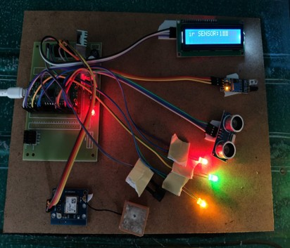
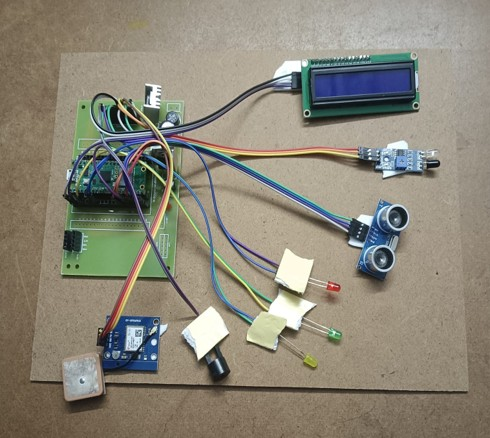

# Underground Cable Fault Detection Using IoT

## Project Overview

An IoT-based underground cable route monitoring system developed using
Raspberry Pi Pico W. The system uses IR and ultrasonic sensors to detect
physical disturbances and obstacles along the cable route.

When an abnormal condition is detected, the system provides local alerts
through an LCD, buzzer, and LED indicators. GPS is used to obtain the
location, while Wi-Fi enables remote monitoring through the ThingSpeak
cloud platform.

## Components Used

- Raspberry Pi Pico W
- IR Sensor
- HC-SR04 Ultrasonic Sensor
- 16x2 I2C LCD Display
- GPS Module
- Buzzer
- LED Indicators
- Jumper Wires
- Breadboard / PCB
- Power Supply

## Technologies Used

- Arduino IDE
- Embedded C/C++
- Raspberry Pi Pico W
- IoT
- Wi-Fi
- ThingSpeak
- GPS
- I2C Communication

## Working Principle

The Raspberry Pi Pico W initializes the sensors, LCD, GPS module,
alert devices, and Wi-Fi connection.

The IR sensor monitors physical damage or break conditions, while the
ultrasonic sensor measures distance to detect obstacles near the
cable route.

When an abnormal condition is detected, the system activates the
buzzer and LED indicators and displays the fault information on the
LCD.

The GPS module provides latitude and longitude information, while
sensor data and location information are transmitted to ThingSpeak
for remote monitoring.

## Features

- Physical damage detection
- Obstacle detection
- Real-time local alerts
- LCD-based status display
- GPS-based location information
- Wi-Fi-enabled remote monitoring
- ThingSpeak cloud data visualization

## Applications

- Underground cable route monitoring
- Smart city infrastructure monitoring
- Industrial campus cable monitoring
- Railway and airport infrastructure monitoring
- IoT-based infrastructure safety systems

## Limitations

- Limited to surface-level physical fault detection
- Cannot detect deep underground or internal electrical faults
- GPS accuracy may vary depending on conditions
- Prototype is not intended for high-voltage cable fault detection

## Project Images

### Experimental Setup

### Project Prototype

